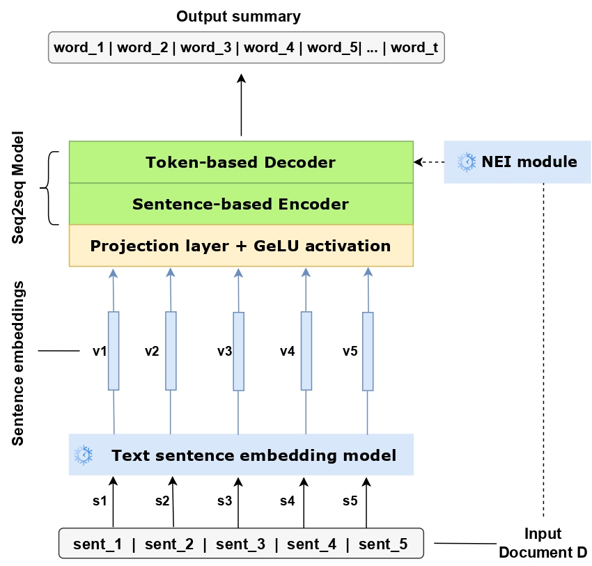

# SBARThez

📄 **[Read the paper](https://hal.science/hal-05665423/)** — LREC 2026

**Official code for the paper "Using Multimodal and Language-Agnostic Sentence Embeddings for Abstractive Summarization"** (LREC 2026).

**Abstract**
Abstractive summarization aims to generate concise summaries by creating new sentences, allowing for flexible rephrasing. However, this approach can be vulnerable to inaccuracies, particularly 'hallucinations' where the model introduces non-existent information. In this paper, we leverage the use of multimodal and multilingual sentence embeddings derived from pre-trained models such as LaBSE, SONAR, and BGE-M3, and feed them into a modified BART-based French model. A Named Entity Injection mechanism that appends tokenized named entities to the decoder input is introduced, in order to improve the factual consistency of the generated summary. Our novel framework, SBARThez, is applicable to both text and speech inputs and supports cross-lingual summarization; it shows competitive performance relative to token-level baselines, especially for low-resource languages, while generating more concise and abstract summaries.

---

## Overview

<p align="center">
  
</p>

SBARThez replaces the token embedding layer of a [BARThez](https://huggingface.co/moussaKam/barthez) sequence-to-sequence model with **sentence-level embeddings** of the source document. Instead of feeding token IDs to the encoder, each source sentence is embedded (by default with [BGE-M3](https://huggingface.co/BAAI/bge-m3)) and the resulting vectors are projected from the embedding dimension (1024) down to the model dimension (768) through a small linear + GELU layer before being passed to the decoder as `inputs_embeds`.

An optional **Named Entity Injection (NEI)** module prepends named-entity tokens — extracted from the source with a [CamemBERT-based French NER model](https://huggingface.co/Jean-Baptiste/camembert-ner) — to the decoder input, in order to improve the factual consistency of generated summaries. NEI can be turned on or off with a single flag (`with_nei`), so you can train and evaluate both the entity-aware and the plain variants from the same codebase.

Data is stored in **Kaldi `ark`/`scp` format**: for each dataset split, three parallel archives are produced (sentence embeddings, tokenized target summaries, and tokenized NER prefixes), keyed by a shared entry ID so they can be re-joined at training time.

## Repository structure

```
SBARThez/
├── configs/
│   └── train_config.yaml        # data paths + training hyperparameters
├── dataset/
│   └── kaldi_dataset.py         # KaldiDataset + collate_fn (reads the 3 scp files)
├── models/
│   └── sbarthez_model.py        # SBARThez_BGE / SBARThez_SONAR / SBARThez_LaBSE
├── scripts/
│   ├── generate_scp_ark.py      # preprocessing: build embeddings/tokens/ner ark+scp
│   ├── train.py                 # training loop (reads configs/train_config.yaml)
│   └── inference.py            # inference + ROUGE / BERTScore evaluation
├── checkpoints/                 # saved model checkpoints (.pth)
├── requirements.txt
└── README.md
```

---

## Installation

Install the Python dependencies with:

```bash
pip install -r requirements.txt
```

**Note on PyTorch / GPU.** If you plan to train or run inference on a GPU, install the `torch` build that matches your CUDA version from the [official PyTorch instructions](https://pytorch.org/get-started/locally/) rather than relying on the plain PyPI wheel, which may be CPU-only.

**Pre-trained models.** The BGE-M3 embedding model (`BAAI/bge-m3`), the BARThez tokenizer/model (`moussaKam/barthez`), and the CamemBERT NER model (`Jean-Baptiste/camembert-ner`) are downloaded automatically from the Hugging Face Hub the first time you run the scripts, so no manual download step is required — only network access.

---

## Usage

### 1. Dataset preparation — generating sentence embeddings

`scripts/generate_scp_ark.py` builds the three parallel `ark`/`scp` archives (embeddings, summary tokens, NER tokens) for one dataset split. It expects a JSONL input where each line has the keys `id`, `text`, and `summary`.

Open the script and set the file paths and split name at the top:

```python
mode = "TRAIN"   # or "VALIDATION" / "TEST"
input_file          = f"/path_to_folder/mlsum_{mode}.jsonl"
embedding_ark_file  = f"/path_to_folder/mlsum_{mode}_embeddings.ark"
embedding_scp_file  = f"/path_to_folder/mlsum_{mode}_embeddings.scp"
tokens_ark_file     = f"/path_to_folder/mlsum_{mode}_tokens.ark"
tokens_scp_file     = f"/path_to_folder/mlsum_{mode}_tokens.scp"
ner_ark_file        = f"/path_to_folder/mlsum_{mode}_ner.ark"
ner_scp_file        = f"/path_to_folder/mlsum_{mode}_ner.scp"
```

Then run it once per split:

```bash
python scripts/generate_scp_ark.py
```

This will produce `*_embeddings.scp`, `*_tokens.scp`, and `*_ner.scp` (plus their `.ark` counterparts) for the chosen split.

### 2. Training

Set your data paths and hyperparameters in `configs/train_config.yaml`:

```yaml
data:
  train_emb_path:       "/path_to_folder/mlsum_TRAIN_embeddings.scp"
  train_token_path:     "/path_to_folder/mlsum_TRAIN_tokens.scp"
  train_ner_token_path: "/path_to_folder/mlsum_TRAIN_ner.scp"
  valid_emb_path:       "/path_to_folder/mlsum_VALIDATION_embeddings.scp"
  valid_token_path:     "/path_to_folder/mlsum_VALIDATION_tokens.scp"
  valid_ner_token_path: "/path_to_folder/mlsum_VALIDATION_ner.scp"

model:
  name: "SBARThez_BGE"
  checkpoint_path: "checkpoints/sbarthez_nei_1.pth"

training:
  batch_size:   16
  num_epochs:   50
  lr_fc:        0.001      # learning rate for the projection layer
  lr_decoder:   0.00001    # learning rate for the BARThez decoder
  weight_decay: 0.00001
  with_nei:     true       # true = use the NEI Module; false = no NEI Module used
```

Then launch training:

```bash
python scripts/train.py
```

Notes:

- `with_nei` toggles the Named Entity Injection module. Set it to `false` to train the plain (no-entity) variant; the rest of the pipeline is unchanged. The setting is saved inside the checkpoint so inference can detect it automatically.
- Two separate `AdamW` optimizers are used — a larger learning rate for the projection layer (`lr_fc`) and a smaller one for the decoder (`lr_decoder`) — each with its own `ReduceLROnPlateau` scheduler. Mixed-precision (`autocast` / `GradScaler`) is enabled.
- The best model on the validation loss is written to `model.checkpoint_path`.

### 3. Inference & evaluation

Run inference and compute ROUGE (1/2/3/4/L) and BERTScore (French, with and without baseline rescaling) with `scripts/inference.py`:

```bash
python scripts/inference.py \
    --ckpt checkpoints/sbarthez_nei_1.pth \
    --emb  /path_to_folder/mlsum_TEST_embeddings.scp \
    --tok  /path_to_folder/mlsum_TEST_tokens.scp \
    --ner  /path_to_folder/mlsum_TEST_ner.scp \
    --beam
```

The `with_nei` setting is **auto-detected from the checkpoint**, so you normally don't need to specify it. If the NEI Module is enabled, `--ner` is required.

**Command-line arguments**

| Argument | Default | Description |
|---|---|---|
| `--ckpt` | *(required)* | Path to the model checkpoint (`.pth`). |
| `--emb` | *(required)* | Path to the embedding `.scp` file. |
| `--tok` | *(required)* | Path to the target-token `.scp` file. |
| `--ner` | `None` | Path to the NER-token `.scp` file. Required when the model uses NEI. |
| `--beam` | off | Use beam-search decoding instead of greedy. |
| `--beam_size` | `3` | Beam size (only used with `--beam`). |
| `--batch_size` | `8` | Inference batch size. |
| `--max_new_tokens` | `512` | Maximum number of tokens generated per example. |
| `--with_nei` | *(auto)* | Force-enable the NEI Module, overriding the checkpoint. |
| `--without_nei` | *(auto)* | Force-disable the NEI Module, overriding the checkpoint. |

For a model trained **without** NEI, you can omit `--ner`:

```bash
python scripts/inference.py \
    --ckpt checkpoints/sbarthez_1.pth \
    --emb  /path_to_folder/mlsum_TEST_embeddings.scp \
    --tok  /path_to_folder/mlsum_TEST_tokens.scp
```

---

## Citation

If you use this code or build on our work, please cite:

```bibtex
@inproceedings{el2026using,
  title={Using Multimodal and Language-Agnostic Sentence Embeddings for Abstractive Summarization},
  author={El Hammoud, Chaimae Chellaf and Mdhaffar, Salima and Est{\`e}ve, Yannick and Huet, St{\'e}phane},
  booktitle={The Fifteenth Language Resources and Evaluation Conference (LREC 2026)},
  pages={9873--9883},
  year={2026}
}
```

---

## Contact

For questions about the paper or the code, please contact:

**Chaimae Chellaf El Hammoud** — <chaimae.chellaf-el-hammoud@alumni.univ-avignon.fr>

You are also welcome to open an issue on this repository.